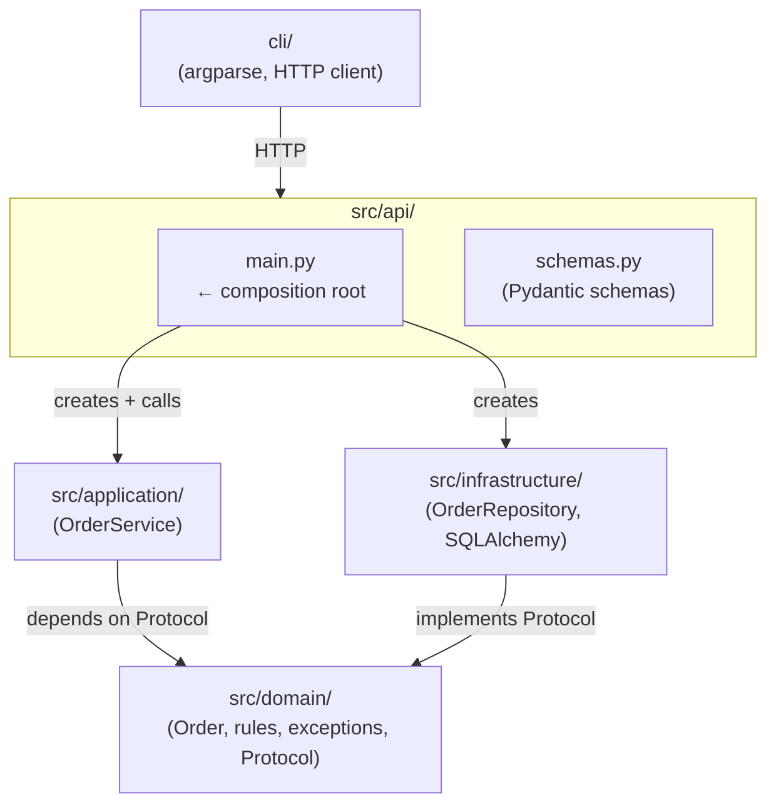
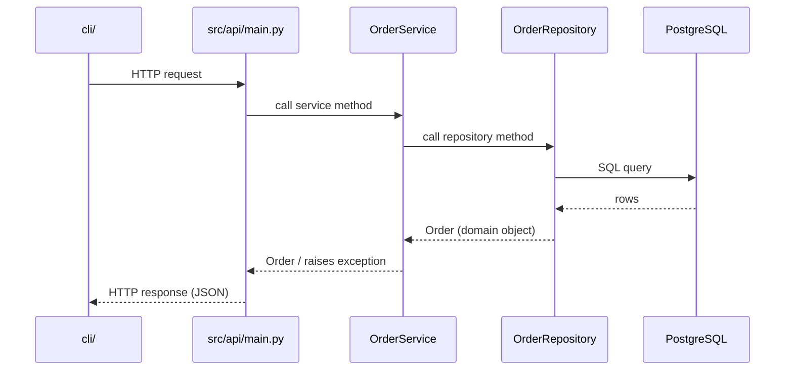
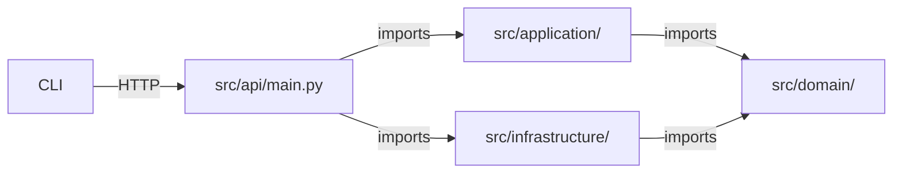

# Architecture

This project follows Domain-Driven Design (DDD) with four layers. Each layer has a single responsibility, and dependencies only point inward — outer layers import from inner layers, never the reverse. Nothing in `src/domain/` imports from any other layer in this project.

## Layer overview

## Layers

### CLI — `cli/`

A command-line interface built with `argparse`. Talks to the API over HTTP — it does not access the domain or database directly.

### API — `src/api/`

The HTTP interface. Accepts requests, validates input, delegates to the service, and maps domain exceptions to HTTP status codes.

- **`main.py`** — FastAPI app, route handlers, and the composition root. The only file that imports from both `src/application/` and `src/infrastructure/` and wires them together.
- **`schemas.py`** — Pydantic models (`OrderCreate`, `OrderUpdate`, `OrderResponse`, `OrderItemSchema`) that validate HTTP input and shape HTTP output.

### Application — `src/application/`

Orchestrates domain objects and infrastructure. Has no HTTP or database knowledge of its own.

- **`services/order_service.py`** — `OrderService`: receives a repository via its constructor, calls domain methods, and raises domain exceptions. Also responsible for ID generation (`uuid4`) and timestamping (`datetime.now`).

### Infrastructure — `src/infrastructure/`

Implements the repository protocol using SQLAlchemy and PostgreSQL.

- **`db/models.py`** — `OrderModel`, `OrderItemModel`: SQLAlchemy ORM models that map to the `orders` and `order_items` tables.
- **`db/repositories/order_repository.py`** — `OrderRepository`: implements `OrderRepositoryProtocol`. Translates between domain objects and ORM models.
- **`db/connection.py`** — `SessionLocal`, `Base`: SQLAlchemy engine and session factory.

### Domain — `src/domain/`

The core of the application. Contains business rules and types only — no knowledge of HTTP, databases, or the CLI.

- **`order.py`** — `Order` aggregate, `OrderItem`, `OrderStatus` enum. `Order.transition_to()` enforces the terminal-state invariant.
- **`state_machine.py`** — `TERMINAL_STATUSES`: the set of statuses from which an order cannot transition.
- **`exceptions.py`** — `OrderNotFoundError`, `InvalidTransitionError`. Raised by the domain, caught by the API layer.
- **`repository.py`** — `OrderRepositoryProtocol`: a structural Protocol that defines what persistence operations the domain expects, without depending on any concrete implementation.

## Data flow

## Dependency rule

`src/api/main.py` imports from both `src/application/` and `src/infrastructure/` as the composition root. `src/application/` imports only from `src/domain/` via the Protocol, never from `src/infrastructure/`. `src/domain/` has no outward arrows.

